#Git Local
Para el uso de git primero debemos iniciar git con:
```
git init
```
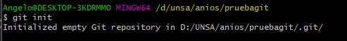
Y lo volveremos una rama **MASTER** 

Luego si se tiene archivos dentro de la carpeta estaran de esta forma **UNCOMMITED** que estan fuera de la rama master la cual se puede ver con:
```
git status
```
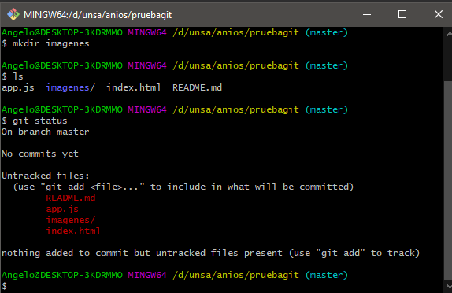
Para que esten dentro de la rama master debemos utilizar el comando:
```
git add nombredelarchivo
```
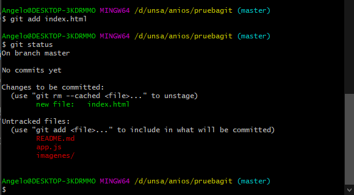

O para agregar todos los archivos:
```
git add .
```
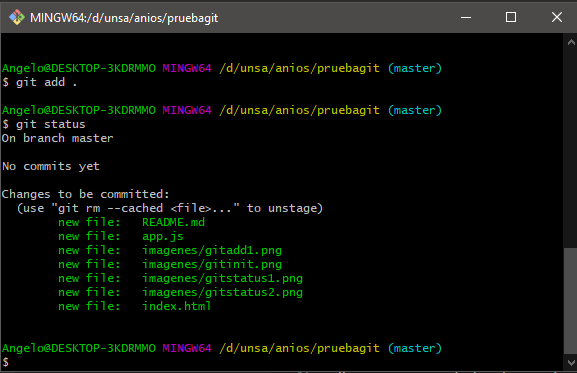
Asi poder hacer que git maneje versiones de estos archivos, osea si modificamos algo de este nos lo va a decir github.

Ahora cuando nosotros modificamos un archivo el controlador de versions git no va a poder hacer los cambios en el repositorio a no ser que le demos primero 'git add', ademas que te mostrara que un archivo y que lineas de este archivo se modificaron si utilizamos:
```
git diff nombrearchivo
```
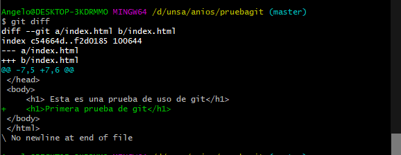
Luego para confirmar todos los cambios que hicimos le hacemos:
```
git commit -m "nombre del archivo"
```
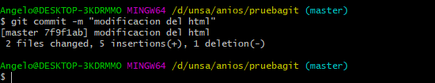
Al realizar esto ya no nos mostrara estos mensajes de que alguien cambio algo del codigo o que modificaste
Luego para ver todas las versiones de modificacion del codigo se utiliza:
```
git log
```


Ahora podemos hacer varias ramas de esta rama master, primero para ver las rmas que tenemos utilizamos el siguiente comando:
```
git branch
```
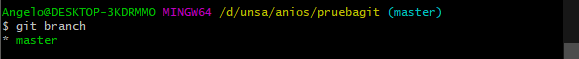
Como podemos ver en la imagen anterior nos esta diciendo que estamos en la rama **MASTER**

Ahora para crear una **RAMA** de este proyecto se realiza con el siguiente comando:
```
git branch nombrerama
```
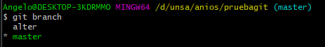
Entonces ahora tenemos una rama llamada ater y como podemos ver aunque creamos una rama, la rama master esta pintada porque aun seguimos trabajando en ella, para poder trabajar con la rama creada realizamos el siguiente comando:
```
git checkout nombrerama
```
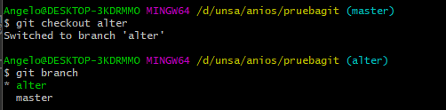
Ahora al crear una rama hace copia de todos los archivos y luego seria como una carpeta que tiene todo similar pero podemos agregar cosas o quitar sin molestar a la rama principal.
Luego podemos ver que la rama lo que agreguemos no se va a agregar a la rama principal:
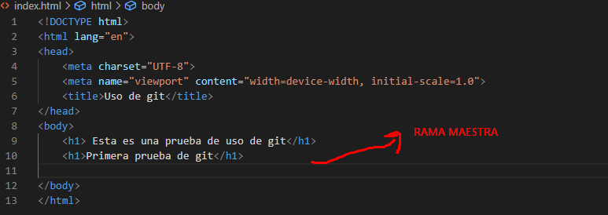


Al final para pasar los cambios de una rama a las master podemos realizar lo siguiente:
```
git merge nombrerama
```
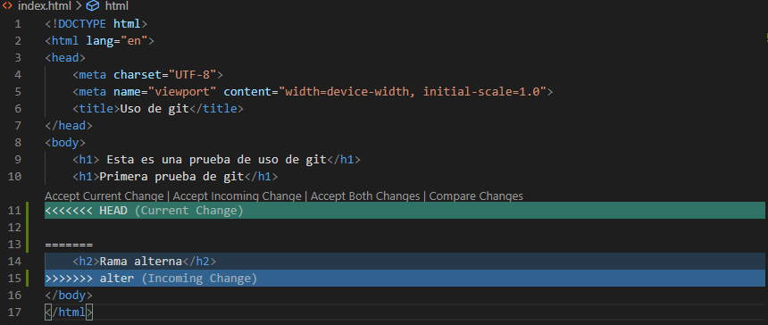
Al final unimos las dos ramas 

Y luego podemos para terminar podemos llevarlo a un repositorio de github con 
```
git remote add origin linkgithub
```
y luego:
```
git push origin master
```
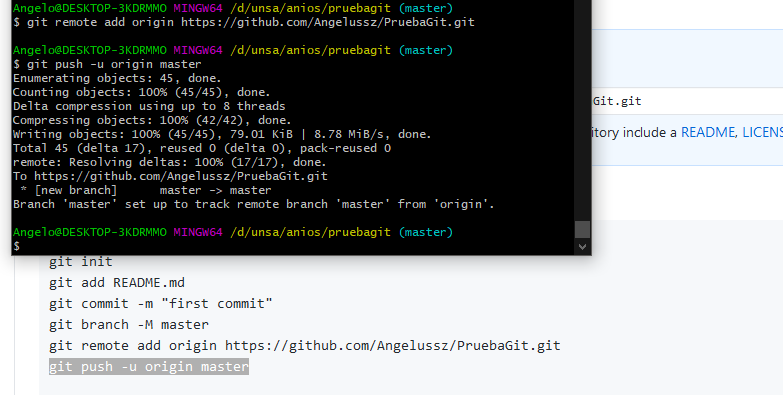
Asi llevamos nuestro codigo local a un repositorio, pero en la practica no es tan fiable hacer eso es mejor crear un repositorio primero y luego hacer todos los cambios que queremos, como ya enviamos un repositorio local a github borraremos el anterior y luego el repositorio que tenemos alojado en github lo enviamos a nuestro pc con:
```
git clone httdelrepositorio
```
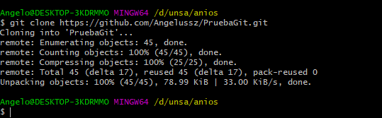
Al final al hacer cualquier modificacion que querramos solo modificamos los archivos y llevamos a github nuestros cambios con:
```
git push 
```
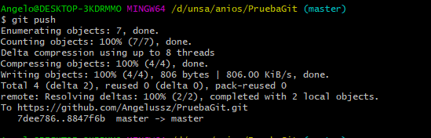